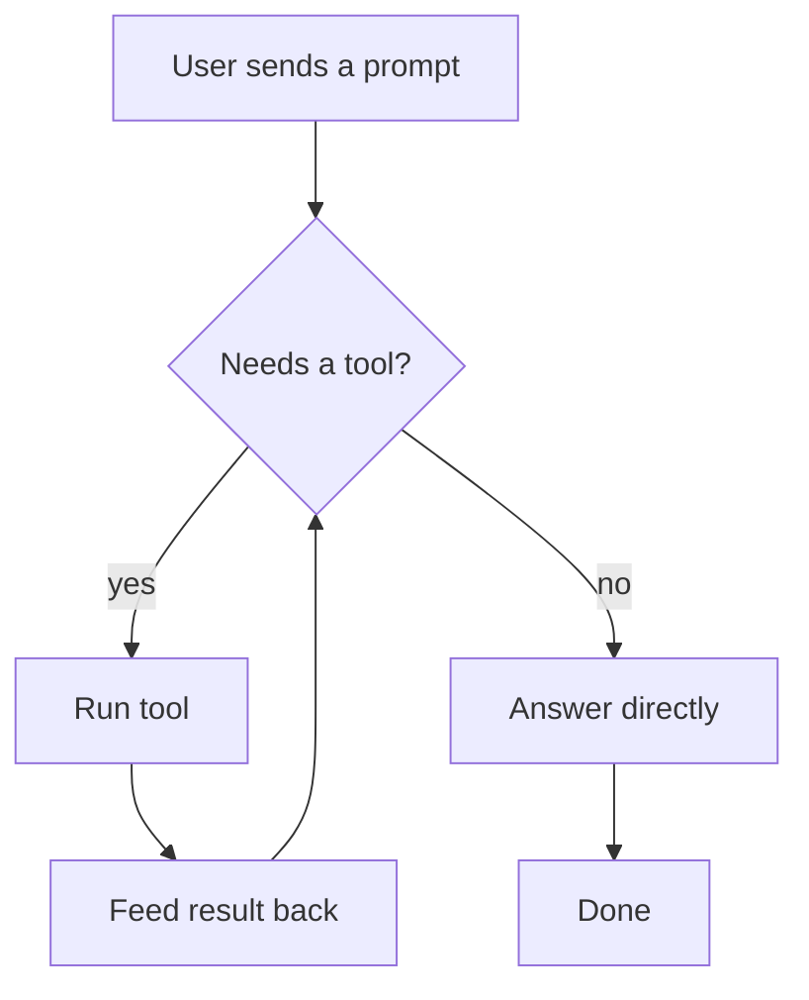
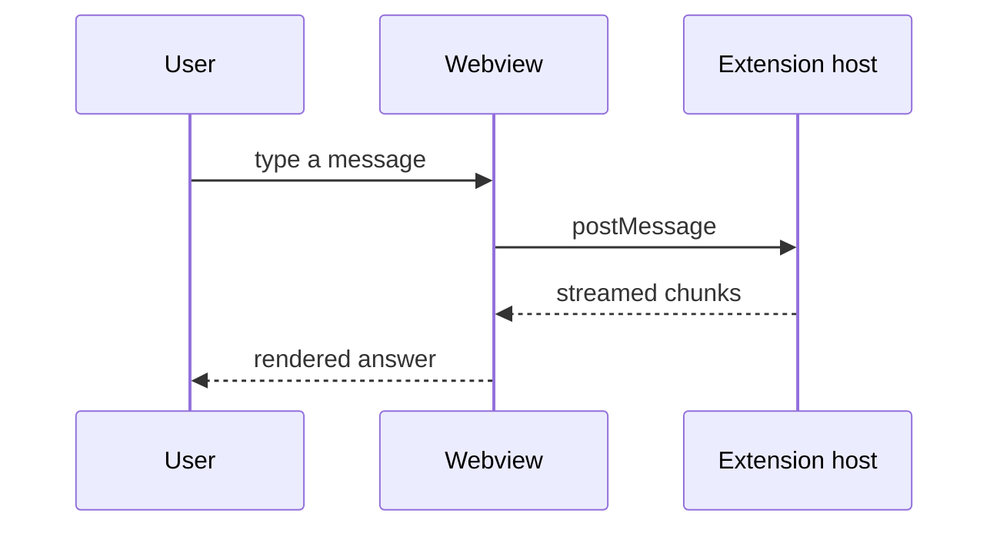

# Preview fixture

Throwaway file for manually testing the markdown/diagram preview in the chat webview.
Delete it when done — it is not part of the extension.

## Markdown surfaces

Headings, **bold**, `inline code`, and a list:

- first item
- second item with a [link](https://example.com)

| Column | Meaning |
| --- | --- |
| A | first |
| B | second |

```ts
const answer: number = 42;
```

## Flowchart



## Sequence diagram



## Intentionally broken diagram

This one must stay a plain code block — no red error diagram.

```mermaid
graph TD
  A[unclosed
```
